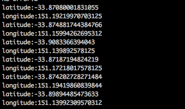

# CFA-SydneyLightRailPosAPI

## Brief

This was a simple application to test node.js and learn some fundamentals including axios and HTTP package called request.

The app returns a list of all Light Rail Trams and their location in lat / long.

## API

The API is from https://opendata.transport.nsw.gov.au/
To use, get an AIP key from the site, and insert it into your ENV_TRANSPORT_API inside bash_profile. (Or hard code it).

## Install & Run
``
npm Install
npm request.js
``
The latitude and longitude is then returned in the console.

